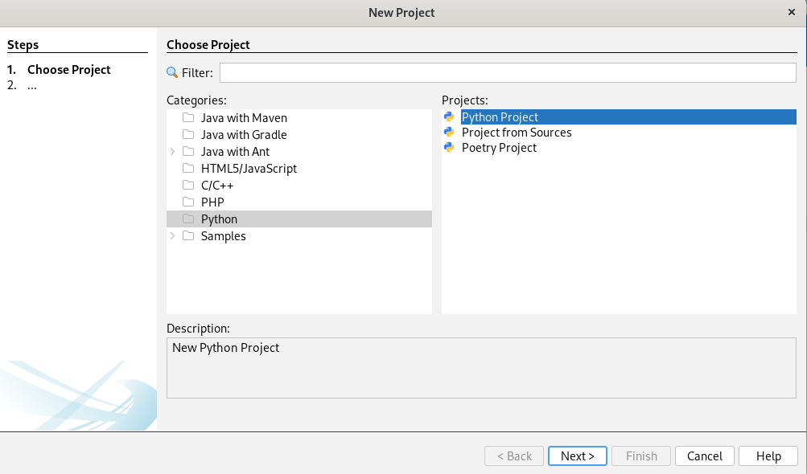
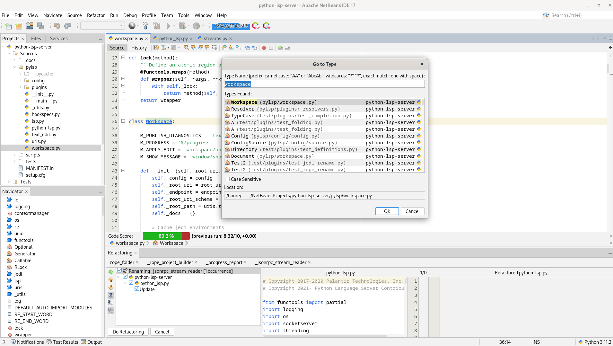
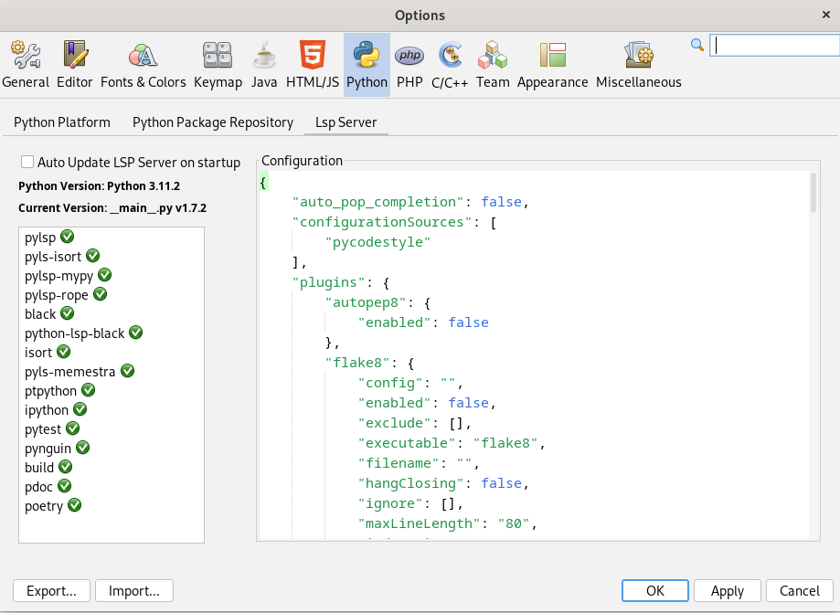
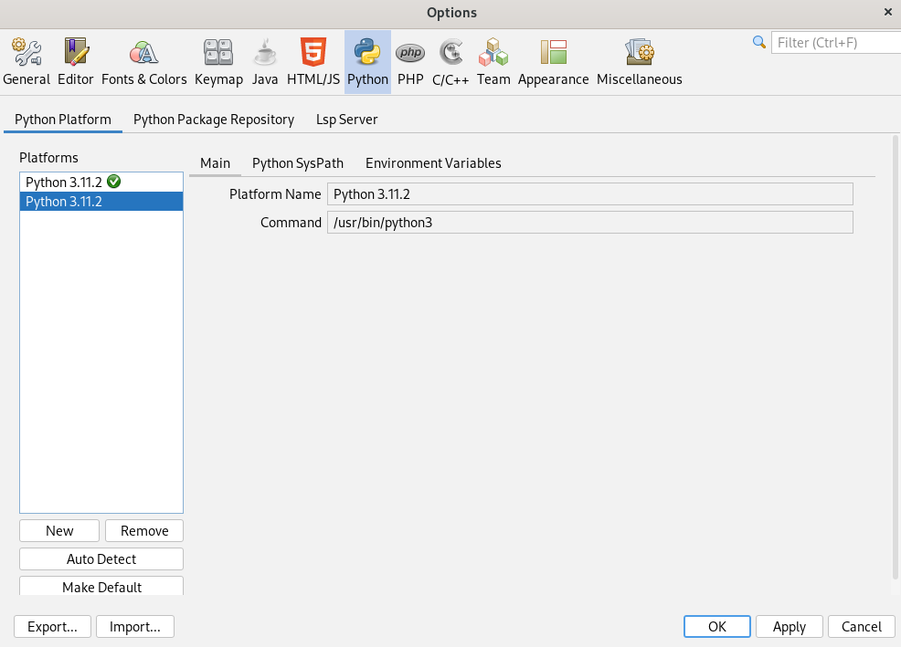
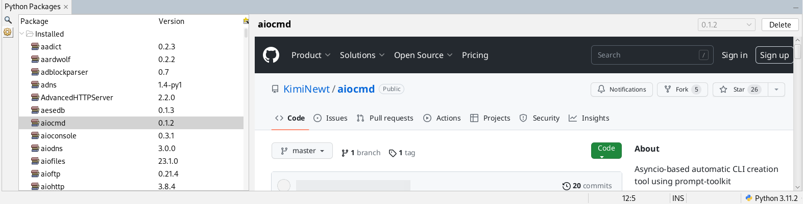
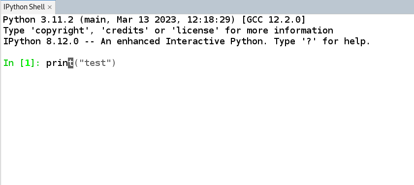
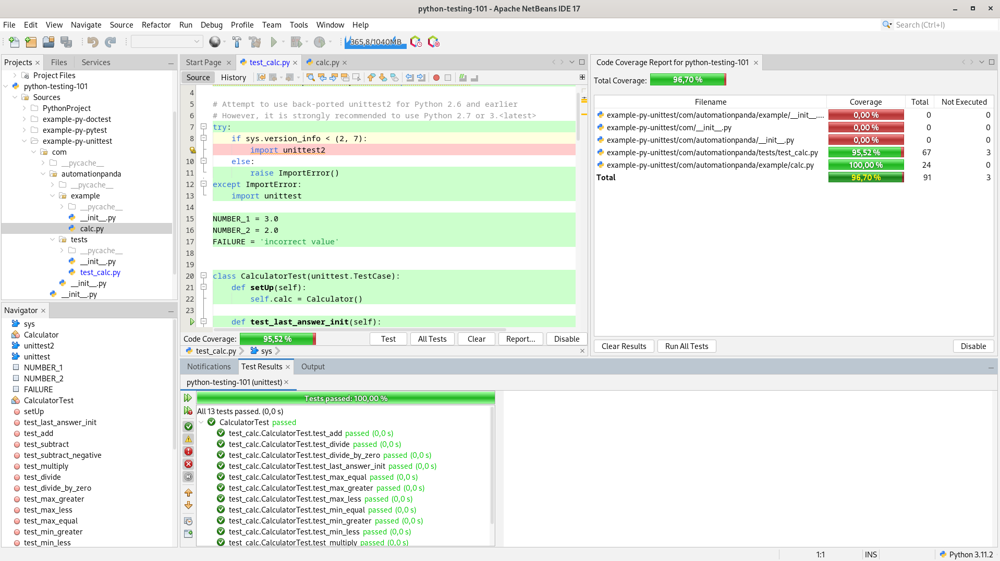
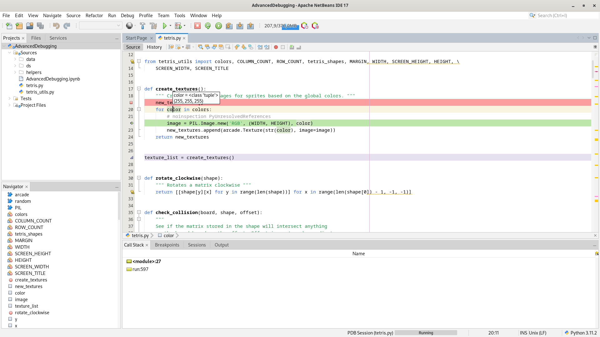

# netbeansPython

 

## User guide

Follow the [Wiki Session](https://github.com/albilu/netbeansPython/wiki) (WIP) for the full `user guide`

### Requirements
  

### Installation
- Install from Netbeans \
    `Tools -> Plugins -> Available Plugins -> Install`
- Or Download the latest [release](https://github.com/albilu/netbeansPython/releases) and install in Netbeans: \
    `Tools -> Plugins -> Downloaded -> Add Plugins -> Install`

### Bugs

Please Report any issue at [Issues](https://github.com/albilu/netbeansPython/issues).

## Goal of netbeansPython

This `plugin` enables [Python Programming Language](https://www.python.org/about/) support for [Apache Netbeans](https://netbeans.apache.org/).
It leverage the `Spyder IDE` community supported [Language Server Protocol](https://github.com/python-lsp/python-lsp-server)

The project is driven by the need to bring to Netbeans similar support for Python as what other main IDEs/Editors (namely [Pycharm](https://www.jetbrains.com/fr-fr/pycharm/)/[Spyder IDE](https://www.spyder-ide.org/)/[VScode](https://code.visualstudio.com/docs/languages/python)) offers.

### Support/Contribute/Sponsor

Support this project growth and maintenance by:
- Starring it 
- Submiting [PR](https://github.com/albilu/netbeansPython/pulls) for issues in the backlog
- [Sponsoring it](https://github.com/sponsors/albilu)

### Related Projects

This is a non exhaustive list of some outstanding projects this module rely on:
- [python-lsp-server](https://github.com/python-lsp/python-lsp-server): Python Language Server *by Spyder IDE Community*
- [pty4j](https://github.com/JetBrains/pty4j): Java implementation of PTY *by JetBrains*
- [pynguin](https://github.com/se2p/pynguin): Python Unit Test Generator

## Main Features
### Project Management
- Simple Python project type creation (with `venv/virtualenv`)
- Import projects from Sources
- Simple [Poetry](https://python-poetry.org/) project creation (common `poetry` commands supported)
- Run/Build projects
    

### LSP Server Features
- [See list of features supported](https://github.com/python-lsp/python-lsp-server#lsp-server-features)
    
- [LSP Configurations](https://github.com/python-lsp/python-lsp-server#configuration) available in Netbeans via: \
    `Tools -> Python Platforms -> Lsp Server`
    

### Python Interpreters Management
- Multiple Python Interpreters Management including [venv](https://docs.python.org/3/library/venv.html#venv-def) and `virtualenv`
    

### Packages Management
- Manage Python Packages (Install/Delete) via [Pypi](https://pypi.org/) or personal Repositories \
    `Windows -> Python Package Manager`
    

### Python REPL
- [IPython](https://github.com/ipython/ipython) and [PTPython](https://github.com/prompt-toolkit/ptpython) integrated as Interactive Shells (with autocompletion) \
    `Windows -> Interactive Python Interpreters -> IPython`
    

### Unittest/Test Coverage
- [Unittest](https://docs.python.org/3/library/unittest.html)/code [coverage](https://coverage.readthedocs.io/en/7.2.2/#) suportted
- Create/Generate unit tests
- Go to test/tested class
    

### Debugger
- Lite Python Debugger relying on the Python internal debugger [PDB](https://docs.python.org/3/library/pdb.html) (breakpoints/callstack/variable inspection) supported
	
