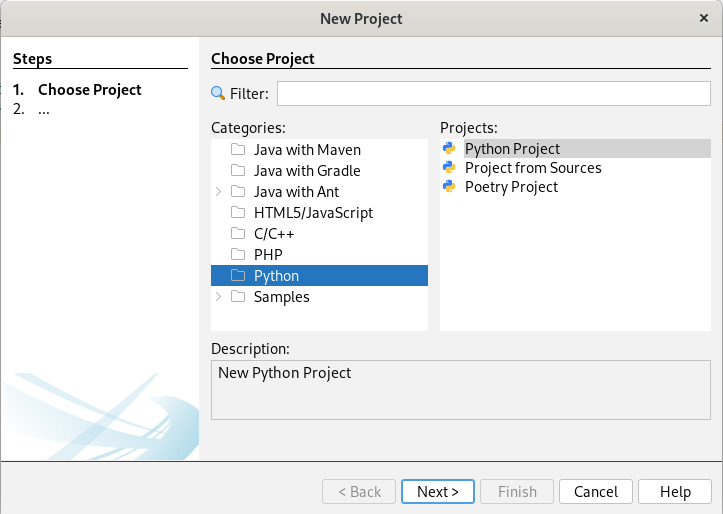

# netbeansPython

## User guide

Follow the [Wiki Session](https://github.com/albilu/netbeansPython/wiki) (WIP) for the full `user guide`

## Goal of netbeansPython?

This `plugin` enables [Python Programming Language](https://www.python.org/about/) support for [Apache Netbeans](https://netbeans.apache.org/).
It leverage the `Spyder IDE` community supported [Language Server Protocol](https://github.com/python-lsp/python-lsp-server)

This project is driven by the need to bring to Netbeans similar support for Python as what other main IDEs/Editors (namely `Pycharm/Spyder IDE/VScode`) offers.

### Requirements
- Python 3.7+
- Netbeans 17
- JDK 11+

## Main Features
### Project Management
- Simple Python projects type creation (with `venv/virtualenv`)
- Import projects from Sources
- Simple `Poetry` porjects creattion (common poetry commands supported)
- Run/Build projects
    

### LSP Server Features
- [See list of features supported](https://github.com/python-lsp/python-lsp-server#lsp-server-features)
    
- LSP Configurations available in Netbeans via: \
    `Tools -> Python Platforms -> Lsp Server` ([configuration explaination](https://github.com/python-lsp/python-lsp-server#configuration))
    

### Python Interpreters Management
- Multiple Python Interpreters Management including `venv` and `virtualenv`
    

### Packages Management
- Manage Python Packages (Install/Delete) via `Pypi` or personal Repositories \
    `Windows -> Python Package Manager`
    

### Python REPL
- `IPython` and `PTPython` integrated as Interactive Shells (with autocompletion) \
    `Windows -> Interactive Python Interpreters -> IPython`
    

### Unittest/Test Coverage
- Unittest/code coverage suportted
- Create/Generate unit tests
- Go to test/tested class
    

## Next Features
Here are list of features to come ordered by priority
- Debugger => TD: 30APR
- Support Pytest framework
- Profiler (inspire from the Spyder IDE one)
- Support Web development frameworks (Django/Flask)
- Jupyter Notebook/Data Science/Conda support (premisces with IPython integrated already)

## Contributing
(WIP)